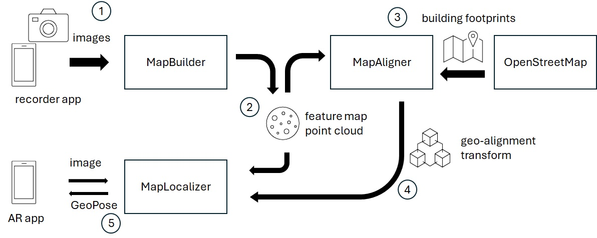
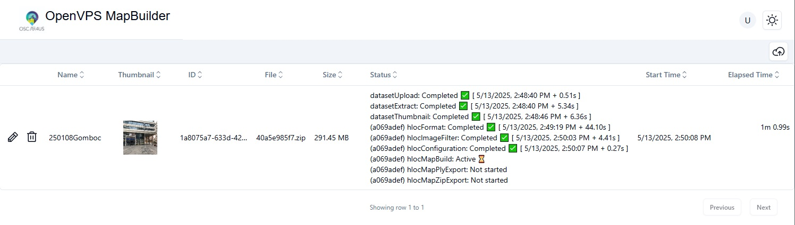
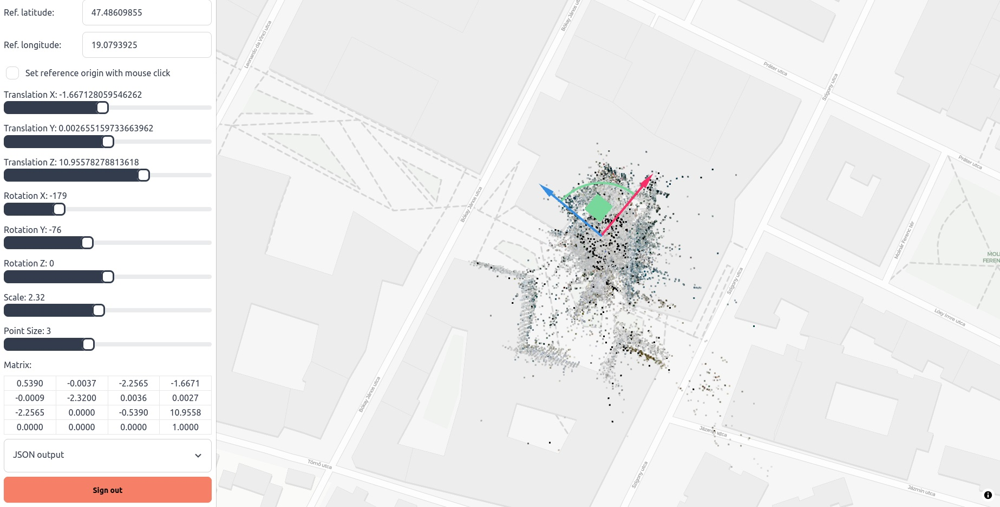

# OpenVPS

Open Visual Positioning Service - Main repository with build scripts and documentation. The project was funded by [NGI Search](https://www.ngisearch.eu/view/Events/OC5Searchers) EU Project and [Open AR Cloud](https://www.openarcloud.org/), 2025.

Authors: Andor Kovacs (@KovacsA22), Denes Bisztray (@bisztray), Gabor Soros (@soeroesg)

Copyright 2025 Nokia
Licensed under the MIT License.
SPDX-License-Identifier: MIT


## Modules
The system consists of 4 main components: MapBuilder, MapAligner, MapLocalizer, and the [HLOC](https://github.com/cvg/Hierarchical-Localization) third-party mapping and localization framework. Authentication via [FusionAuth](https://fusionauth.io/) is used to protect the maps.

First, images are captured by a smartphone app (currently the format of [StrayScanner](https://docs.strayrobots.io/) is supported), and uploaded to the MapBuilder for processing. The MapBuilder runs the HLOC mapping pipeline, and the map points are also exported as a PLY point cloud. The MapAligner loads the PLY point cloud and an OpenStreetMap map tile, and the user manually aligns the point cloud with the building footprints on the map. The resulting 3D transform can be saved to the MapBuilder. Finally, a map with its transform can be loaded into the MapLocalizer, which can then localizes query images sent by mobile devices. The localization happens in the HLOC map first, but using the geo-alignment transform, the result is converted to OGC GeoPose format.




### Hierarchical-Localization

[HLOC](https://github.com/cvg/Hierarchical-Localization) is a widely used library for visual localization. It contains a wide range of important algorithms. We wrap this library into a map creation service and into a localization service.

### Map Builder

Frontend and backend server code for creating HLOC maps from StrayScanner (and in the future other) RGBD recordings.

Also see [README](mapbuilder/README.md)



### Map Aligner

This is a web service that takes a point cloud and an OpenStreetMap tile and allows the user to scale/rotate/translate the point cloud on the map for geo-alignment.

Also see [README](mapaligner/README.md)



### Map Localizer

This is a web service that takes an HLOC map and localizes a query image in it. The response is OGC [GeoPose](https://www.ogc.org/standards/geopose/) format. The API corresponds to the Open AR Cloud [GeoPoseProtocol](https://github.com/OpenArCloud/oscp-geopose-protocol).

Also see [README](maplocalizer/README.md)

### Authentication
We use FusionAuth for OAuth2 authentication to protect the maps. We chose it because it can run locally on the host machine. Download and run FusionAuth locally in Docker. See [this](/docs/FusionAuth.md) documentation on how to configure FusionAuth.


## Setup

The mapbuilder and maplocalizer require an nvidia GPU, at least in the ballpark of GeForce 1080 but a more powerful one is recommended.

You will also need an own domain name and a corresponding SSL certificate, and you need to forward 4 ports to your host machine. It is recommended to run NGINX on your host machine to terminate the TLS tunnels and forward the connections to the openvps containers that run HTTP servers.


Install `docker` and `nvidia-container-toolkit` ([link](https://docs.nvidia.com/datacenter/cloud-native/container-toolkit/latest/install-guide.html)) so that the containers can have GPU access.


Continue with the installation and configuration of the authentication, see the description in [this](/docs/FusionAuth.md) document. You will need to create a tenant and an application. Mark the  client ID and client secret of your new application, these will be filled later into our environment variables `AUTH_FUSIONAUTH_ID` and `AUTH_FUSIONAUTH_SECRET`. The `AUTH_SECRET` is a secret generated with `openssl` and it must be the same for all client applications that want to use this authentication service.


Clone this repository:
```
cd $HOME/dev
git clone https://github.com/OpenArCloud/openvps.git
```

Clone HLOC:
```
cd $HOME/dev/openvps
git clone https://github.com/cvg/Hierarchical-Localization.git
cd Hierarchical-Localization
git checkout abb252080282e31147db6291206ca102c43353f7
git submodule update --init --recursive
```

Write a `docker.env` configuration file based on this template:
```sh
# -- Common configuration
# Network proxy as http://<host>:<port> (default empty)
MY_HTTP_PROXY=
MY_HTTPS_PROXY=

# User and group id of your host user if you want to be able to read/write the map files outside docker. You can get these by the 'id' command in the host Ubuntu
MY_USER_ID=1000
MY_GROUP_ID=1000

# Default reference point in geo coordinates
DEFAULT_LONGITUDE=
DEFAULT_LATITUDE=
DEFAULT_HEIGHT=0

# Shared folder where maps are stored (default ${HOME}/data/maps)
MY_SHARED_MAPS_DIR=${HOME}/data/maps

# Auth.JS env variables
AUTH_FUSIONAUTH_ID=
AUTH_FUSIONAUTH_SECRET=
AUTH_FUSIONAUTH_ISSUER=https://your.domain.name:your_external_auth_port
AUTH_SECRET=


# -- MapBuilder (frontend) configuration
# This is the port that you can access on localhost. The 'frontend' container listens on these two ports.
MAPBUILDER_PORT=80
MAPBUILDER_PORT_HTTPS=443

# -- MapAligner configuration
# This is the port that you can access on localhost. The 'mapaligner' container listens on this port.
MAPALIGNER_PORT=your_host_mapaligner_port
# This is your external URL from the Internet, assuming that you configured NGINX to map from your_external_mapaligner_port to your_internal_mapaligner_port
MAPALIGNER_URL=https://your.domain.name:your_external_mapaligner_port

# -- MapLocalizer configuration
# This is the port that you can access on localhost. The 'maplocalizer' container listens on this port.
MAPLOCALIZER_PORT=your_host_maplocalizer_port
# This is your external URL from the Internet, assuming that you configured NGINX to map from your_external_maplocalizer_port to your_host_maplocalizer_port
MAPLOCALIZER_URL=https://your.domain.name:your_external_maplocalizer_port
```


For example, let us assume that the domain name of your OpenVPS is `https://openvps.org` and the following _external_ ports are used:
- 8045 for FusionAuth
- 8046 for MapLocalizer
- 8047 for MapBuilder
- 8048 for MapAligner

These ports need to be forwarded from your router to your host machine. You need to adapt in the `docker.env` file the internal ports where the actual services are running on your host machine. If you also use nginx for port mapping on the host machine, the internal service ports cannot be the same as the external ports.

For example, let us assume that the following _internal_ ports are used:
- 18045 for FusionAuth
- 18046 for MapLocalizer
- 18047 for MapBuilder
- 18048 for MapAligner

The corresponding example configuration is shown below:
```
MAPALIGNER_PORT=18048
MAPALIGNER_URL=https://openvps.org:8048
MAPBUILDER_PORT=18047
MAPBUILDER_PORT_HTTPS=18443
MAPBUILDER_URL=https://openvps.org:8047
MAPLOCALIZER_PORT=18046
MAPLOCALIZER_URL=https://openvps.org:8046
```

Make sure to configure FusionAuth to accept your actual request and redirect URLs. See [README-FusionAuth.md](/README-FusionAuth.md).


Start all services:
```sh
docker compose --env-file docker.env --progress=plain build
docker compose --env-file docker.env --progress=plain up
```

Stop services:
```sh
docker compose --env-file docker.env --progress=plain down
```

## Usage

### Recording
Once you got your OpenVPS services running, you will need to create your first map. Our first version supports map creation from iOS RGBD+pose recordings, which can be recorded with the free and open [StrayScanner](https://docs.strayrobots.io/) app. Record a sequence while making sure that you move slowly, you cover the building facades from a distance, and you make loops in your trajectory. Do not go too close to objects, avoid textureless areas, avoid shiny and mirroring surfaces like glass, and do not rotate the phone in one place. At the beginning, we recommend to experiment with recordings of about 1 minute in length.

### Upload
Once you recorded a sequence, go to the iOS Files app on your phone, find the files on your phone, and the StrayScanner folder within. Select your recording's folder and compress it to a zip file. Open your mapbuilder URL in Safari, log in, and upload your zip file. This may take up to a few minutes depending on your connection speed and the size of the recording.

### MapBuilder
Once you uploaded your image sequence dataset, it will get a unique ID assigned, it gets extracted, the video gets converted to an image sequences, the images get resized and rotated, and a thumbnail gets assigned to the dataset. Now you can start the map building process by pressing the play button. This might take around 10-30 minutes depending on the size of your recording.

### MapAligner
Once the map is built, more buttons will appear in the dataset's GUI. Next, you need to align the map with the world by clicking on the cross arrows icon, which opens the MapAligner with the corresponding map. First you need to define the coarse location by navigation the map view to your mapped street. Open the 'set reference origin' panel and check 'set reference origin with click'. Click on any point that you want to be the reference of the alignment, it can be any point in the neighborhood. Next, perform the map alignment with the gizmo. You can adjust the scale with the sliders in the left side menu. Finally, press the big green save button, this writes the transform to the MapBuilder.

### MapLocalizer
Once your map is aligned with the world, it is ready to be served in the MapLocalizer. Click on the localization pin icon of the dataset's GUI, which loads the map into the MapLocalizer. This might take up to 30 seconds depending on the map size. Once the map is loaded, you can send GeoPoseRequest queries to the MapLocalizer's `/localize/geopose` endpoint. 

### VPS Queries
You can find example clients in Open AR Cloud repositores based on a WebXR client in [spARcl](https://github.com/OpenArCloud/sparcl), a Cesium client in [cesium-viewer](https://github.com/OpenArCloud/cesium-viewer), and C++ and Python console clients in [oscp-geopose-protocol](https://github.com/OpenArCloud/oscp-geopose-protocol).

The camera intrinsics are also required in the queries. If you send queries via spARcl, it submits the camera intrinsics automatically. If you use other clients, you need to find out somehow the intrinsics. The stock Android Photo app writes them into the EXIF metadata of the photos, you can read those out. You can also use images from StrayScanner recordings as queries (same sequence as for mapping or other recording, does not matter), because StrayScanner also saves the intrinsics. The Cesium client reads the intrinsics from the EXIF. The C++ and Python clients take the intrinsics from a JSON file that the user needs to write before the query.


## Troubleshooting

### ERROR: Unexpected bus error encountered in worker. This might be caused by insufficient shared memory (shm)

Increase `shm_size` in docker-compose.yml (backend and maplocalizer service)

### Unable to verify leaf signature

Add `NODE_TLS_REJECT_UNAUTHORIZED=0` environment variable to backend and mapaligner service in docker-compose.yml

### [auth][error] TypeError: fetch failed

The identity provider cannot be reached due to either a connection issue or the TLS error above. If self-hosted, check if it is running

### FusionAuth login error
We found that the FusionAuth container sometimes dies and this results in a misconfiguration error message on the login screen. In this occurs, restart the FusionAuth container.

